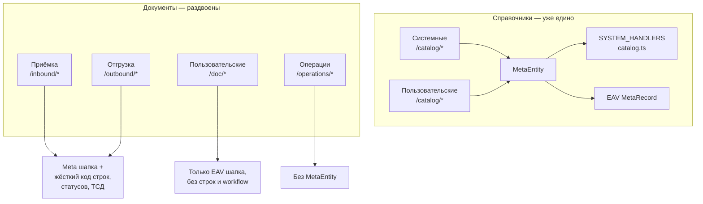
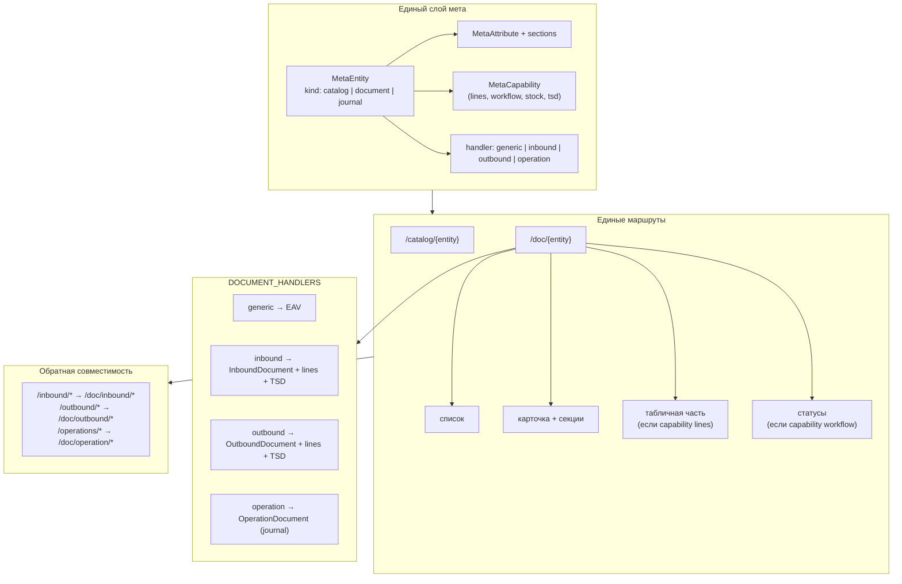
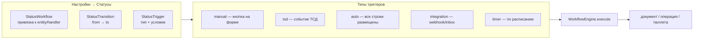

# WMS-конструктор: план переключения (switch-plan)

Документ описывает поэтапную унификацию документов и операций под единую мета-модель — по аналогии с тем, как **справочники уже работают сегодня**.

Связанные документы: [ARCHITECTURE.md](./ARCHITECTURE.md), [status-matrix.md](./status-matrix.md).

---

## 1. Цель

| Принцип | Смысл |
|---------|--------|
| **Одна мета-модель** | Все сущности (справочники, документы, журналы) описаны в `MetaEntity` + `MetaAttribute` |
| **Один UI-шаблон** | Список → карточка → секции формы → (опционально) табличная часть |
| **Два слоя хранения** | `storage: system` → типизированные таблицы Prisma; `storage: custom` → EAV |
| **Handlers вместо разрозненного кода** | Поведение (строки, статусы, остатки, ТСД) — подключаемые capability у handler'а, не дублирование страниц |
| **Системное ≠ настраиваемое** | Приёмка остаётся приёмкой (фиксированные реквизиты и складская логика); пользовательский документ — чистый конструктор |

---

## 2. Схема «сейчас»



### Что уже общее

- `MetaEntity` / `MetaAttribute` / `MetaFormSection` — схема для всех типов сущностей
- `seed-system.ts` — системные приёмка/отгрузка как `kind: document`
- `MetaDocumentFields` — рендер шапки inbound/outbound из мета
- `document-meta.ts` — EAV-расширения на системных документах
- `/catalog/[entity]` — единый маршрут для system + custom справочников

### Что разъехалось

| Аспект | Системные документы | Пользовательские | Операции |
|--------|---------------------|------------------|----------|
| Маршрут | `/inbound`, `/outbound` | `/doc/{code}` | `/operations` |
| Сохранение | `document-form-actions.ts` | `saveCatalogFromForm` | `operation-document.ts` |
| Строки | `InboundLine` / `OutboundLine` | нет | `OperationLine` |
| Статусы | код + `Status` + история | нет | enum + `Status` |
| Права | `module.inbound` | `menu.document.{code}` | `module.operations` |
| Админ «Мета» | inbound/outbound в seed | создаются в UI | не в мета |

---

## 3. Схема «после» (целевое состояние)



### Иерархия в проекте (единая)

```
НСИ (/nsi)
├── системные справочники     → /catalog/{code}     [handler: system-catalog]
├── пользовательские справочники → /catalog/{code}  [handler: generic]
└── (будущее) системные документы НСИ → /doc/{code}

Модули (приёмка, отгрузка, операции)
└── документы модуля          → /doc/{code}         [handler: inbound|outbound|operation]

Пользовательские разделы (/m/{nav})
├── справочники раздела       → /catalog/{code}
└── документы раздела         → /doc/{code}         [handler: generic]
```

### Права (целевые)

| Сущность | View | Write | Примечание |
|----------|------|-------|------------|
| Системный справочник | `nsi.{catalog}` | `nsi.{catalog}.write` | без изменений |
| Custom справочник (НСИ) | `nsi.catalog.{code}` | `nsi.catalog.{code}.write` | без изменений |
| Custom справочник (меню) | `menu.catalog.{code}` | `menu.catalog.{code}.write` | без изменений |
| Системный документ | `document.{code}` | `document.{code}.write` | новое; алиас `module.inbound` → `document.inbound` |
| Custom документ | `nsi.document.{code}` / `menu.document.{code}` | + `.write` | без изменений |
| Журнал операций | `document.operation` | `document.operation.write` | read-only для большинства ролей |

---

## 4. Этапы переключения

Каждый этап — отдельный PR, зелёные тесты, возможность отката через feature-flag.

### Feature-flag (сквозной)

Добавить в `Settings` (или env для dev):

```ts
constructorDocuments: boolean  // этапы 1–3
constructorLines: boolean      // этап 4
constructorOperations: boolean // этап 5
```

Пока flag выключен — старые маршруты и код работают как сейчас.

---

### Этап 0 — Подготовка (1 PR, ~0 риска)

**Цель:** заложить типы и реестр без смены поведения.

| Задача | Файлы |
|--------|-------|
| Типы handler / capability | `src/lib/meta/types.ts` (новый) |
| Реестр документов | `src/lib/meta/document-registry.ts` (новый) |
| Расширить seed: `handler` для inbound/outbound | `src/lib/meta/seed-system.ts` |
| Тесты реестра | `src/lib/meta/document-registry.test.ts` |

**Prisma (опционально на этом этапе):**

```prisma
model MetaEntity {
  // ...
  handler     String?   // "generic" | "inbound" | "outbound" | "operation"
  routePrefix String?   // override, default "/doc"
}
```

Миграция: `20260831_meta_entity_handler`.

**Критерий готовности:** тесты зелёные, UI не изменился.

---

### Этап 1 — Единые маршруты документов (2–3 PR)

**Цель:** `/doc/inbound`, `/doc/outbound` — основные URL; старые пути редиректят.

| Задача | Файлы |
|--------|-------|
| Обобщить layout документа | `src/app/doc/[entity]/layout.tsx` — принимать `storage: system` + `kind: document` |
| Списки inbound/outbound под `/doc` | `src/app/doc/[entity]/page.tsx` — ветка для system handlers |
| Карточки | `src/app/doc/[entity]/[id]/page.tsx` — делегировать в handler-specific panels |
| Создание | `src/app/doc/[entity]/new/page.tsx` |
| Handler-specific UI (строки, статус) | `src/components/doc-handlers/inbound-detail.tsx`, `outbound-detail.tsx` (вынести из `inbound/[id]`, `outbound/[id]`) |
| Редиректы | `src/app/inbound/**/page.tsx` → `redirect(/doc/inbound/...)` |
| | `src/app/outbound/**/page.tsx` → `redirect(/doc/outbound/...)` |
| Модуль registry | `src/lib/modules/registry.ts` — добавить `/doc/inbound`, `/doc/outbound` в `routePrefixes` |
| Proxy | `src/proxy.ts` — проверка прав по entity, не только по prefix |
| Sidebar / quick-create | `build-sidebar-links.ts`, `quick-create-actions.ts` — новые href |
| ТСД API | ссылки в ответах API: canonical `/doc/inbound/{id}` (старые URL в ответе deprecated) |

**Исключения (остаются отдельными под-маршрутами):**

- `/inbound/docks/*`, `/inbound/transport/*` — вспомогательные справочники приёмки; позже → `/catalog/receiving_dock` или nested `/doc/inbound/docks` (решить на ревью этапа 1).

**Критерий готовности:**

- [ ] Список и карточка приёмки открываются по `/doc/inbound` и `/doc/inbound/{id}`
- [ ] `/inbound/{id}` → 308 на новый URL
- [ ] ТСД-сценарии приёмки не сломаны
- [ ] Пользовательские `/doc/{custom}` без изменений

**Откат:** `constructorDocuments = false`, редиректы не регистрируются.

---

### Этап 2 — Единый рендерер форм (1–2 PR)

**Цель:** одна точка рендера реквизитов для system + custom документов.

| Задача | Файлы |
|--------|-------|
| Объединить компоненты | `src/components/meta-record-fields.tsx` (новый, из `MetaDocumentFields` + `CustomMetaRecordFields`) |
| Виджеты | `src/lib/meta/widgets/` — `counterparty_supplier`, `receivingDock`, `transportUnit`, `readonly` |
| Секции | общий `MetaFormSections` для catalog и document |
| Удалить дубли | deprecate `custom-meta-record-fields.tsx`, `meta-document-fields.tsx` → re-export |

**Критерий готовности:**

- [ ] Шапка inbound/outbound/custom выглядит и ведёт себя одинаково (секции, required, readonly)
- [ ] Доп. реквизиты (EAV) на системных документах работают

---

### Этап 3 — DOCUMENT_HANDLERS (2 PR)

**Цель:** один вход сохранения документа, как `SYSTEM_HANDLERS` для справочников.

| Задача | Файлы |
|--------|-------|
| Интерфейс handler | `src/lib/meta/document-handlers/types.ts` |
| Реализации | `generic.ts`, `inbound.ts`, `outbound.ts` |
| Фасад | `src/lib/meta/document-handlers/index.ts` — `listDocuments`, `getDocument`, `saveDocumentFromForm`, `createDocument` |
| Миграция actions | `document-form-actions.ts` → thin wrapper над handler |
| | `meta/actions.ts` `createDocumentRecord` → handler |
| Тесты | `document-handlers/inbound.test.ts`, `generic.test.ts` |

```ts
type DocumentHandler = {
  entityCode: string;
  list: (filters) => Promise<DocumentRow[]>;
  get: (id: string) => Promise<DocumentRow>;
  create: (formData: FormData) => Promise<string>;
  update: (id: string, formData: FormData) => Promise<void>;
  capabilities: DocumentCapability[];
};
```

**Критерий готовности:**

- [ ] Создание/редактирование inbound, outbound, custom — через `saveDocumentFromForm`
- [ ] Нет прямых вызовов `saveInboundDocumentMeta` из страниц (только handler)

---

### Этап 4 — Табличная часть в мета (3–4 PR)

**Цель:** строки документа описываются в мета; системные колонки с `systemField`, custom — EAV.

**Prisma:**

```prisma
model MetaLineDefinition {
  id           String @id @default(cuid())
  entityCode   String
  code         String   // "lines"
  name         String   // "Товары"
  @@unique([entityCode, code])
}

model MetaLineColumn {
  id             String @id @default(cuid())
  lineDefId      String
  code           String
  name           String
  type           String
  systemField    String?
  refEntityCode  String?
  required       Boolean @default(false)
  sortOrder      Int     @default(0)
}
```

Для custom документов со строками — `MetaLineRecord` / `MetaLineValue` (или JSON в `MetaValue` type `table` на первом проходе).

| Задача | Файлы |
|--------|-------|
| Seed колонок inbound/outbound | `seed-system.ts` — `lineDefinitions` |
| UI таблицы строк | `src/components/meta-document-lines.tsx` |
| Сохранение строк | handler `saveLines` в inbound/outbound handlers |
| Пользовательские документы | capability `lines` при создании документа в админке |

**Критерий готовности:**

- [ ] Inbound/outbound строки рендерятся из мета (не хардкод колонок в JSX)
- [ ] Можно создать custom-документ с простой табличной частью (string/number/ref)

**Откат:** `constructorLines = false` → старый JSX для строк inbound/outbound.

---

### Этап 5 — Операции в мета + права (2 PR)

**Цель:** `OperationDocument` — `MetaEntity` с `handler: operation`, маршрут `/doc/operation` (журнал, read-heavy).

| Задача | Файлы |
|--------|-------|
| Seed entity `operation` | `seed-system.ts` |
| Handler operation (list/get only) | `document-handlers/operation.ts` |
| Редирект | `/operations` → `/doc/operation` |
| Права | `document.operation` + миграция алиасов `module.operations` |
| Registry | убрать отдельный module route или оставить как alias |

**Критерий готовности:**

- [ ] Журнал операций по `/doc/operation`
- [ ] Карточка операции — мета-шапка + строки из seed
- [ ] Putaway/receive/transfer по-прежнему создают `OperationDocument` через engine

---

### Этап 6 — Унификация прав (1 PR)

**Цель:** единый resolver `permissionForEntity(entityCode, action)`.

| Задача | Файлы |
|--------|-------|
| Resolver | `src/lib/permissions/entity-permissions.ts` |
| Алиасы в check | `module.inbound` ≡ `document.inbound` (transition period) |
| Матрица ролей | `registry.ts`, admin roles UI |
| Proxy + session | `proxy.ts`, `session.ts` |

**Критерий готовности:**

- [ ] Одна функция для catalog + document + journal
- [ ] Старые permission codes продолжают работать (deprecated)

---

### Этап 7 (будущее) — Настраиваемые статусы и триггеры

> Отдельный проект после этапов 1–6. Не блокирует конструктор документов.

**Проблема сейчас:** переходы статусов зашиты в код (`inbound-status.ts`, TSD API, кнопки на карточке). Справочник `Status` знает только `forInbound`, `forOutbound`, … — жёсткие флаги.

**Целевая модель:**



**Prisma (черновик):**

```prisma
model StatusWorkflow {
  id          String @id @default(cuid())
  code        String @unique
  name        String
  entityCode  String?   // MetaEntity или wildcard "inbound"
  appliesTo   String    // "document" | "operation" | "pallet"
}

model StatusTransition {
  id           String @id @default(cuid())
  workflowId   String
  fromStatusId String?
  toStatusId   String
  sortOrder    Int @default(0)
  triggers     StatusTrigger[]
}

model StatusTrigger {
  id           String @id @default(cuid())
  transitionId String
  kind         String  // manual | tsd | auto | integration | script
  config       Json    // { "event": "receive.complete" }, { "allLinesPlaced": true }
  requiredPerm String? // permission для manual
  label        String? // текст кнопки
}
```

| Задача | Описание |
|--------|----------|
| Админ UI | `/admin/statuses` — workflow, переходы, триггеры |
| Engine | `src/lib/workflow/engine.ts` — `canTransition`, `executeTransition` |
| Миграция seed | текущая матрица из `status-matrix.md` → записи в БД |
| Замена кода | `inbound-status-control.tsx` → кнопки из `StatusTrigger kind=manual` |
| ТСД | вместо hardcode `RELEASED→ACCEPTED` — lookup transition by event |
| Capability | `MetaCapability.workflow` на entity |

**Критерий готовности:**

- [ ] Админ может добавить статус и переход для приёмки без деплоя
- [ ] ТСД-события сопоставляются с триггерами в настройках
- [ ] Один workflow может использоваться в нескольких entity (например, DRAFT→RELEASED→DONE)

---

## 5. Порядок PR и зависимости

```
Этап 0 ──► Этап 1 ──► Этап 2 ──► Этап 3
                              └──► Этап 4
                              └──► Этап 5 ──► Этап 6
                                                    └──► Этап 7 (статусы)
```

Рекомендуемая последовательность работ: **0 → 1 → 2 → 3** (минимальный «конструктор документов»), затем **4** (строки), **5–6** (операции и права), потом **7** (статусы с триггерами).

---

## 6. Чеклист регрессии (на каждый этап)

- [ ] `npm test` — все unit-тесты
- [ ] Создание приёмки → RELEASED → приёмка ТСД → ACCEPTED → размещение → PLACED
- [ ] Создание отгрузки → RELEASED → отбор ТСД → POSTED
- [ ] Custom catalog: CRUD в НСИ и в `/m/{nav}`
- [ ] Custom document: CRUD в `/doc/{code}`
- [ ] Права viewer / operator / admin на все типы сущностей
- [ ] Редиректы со старых URL (закладки пользователей)
- [ ] Integration inbox: `inbound.create`, `outbound.create`

---

## 7. Откат

| Этап | Действие |
|------|----------|
| 1 | `constructorDocuments=false`; страницы `/inbound` снова primary |
| 3 | страницы вызывают старые `save*Meta` напрямую |
| 4 | `constructorLines=false` |
| 5–6 | редирект `/doc/operation` off; `module.operations` primary |
| 7 | engine off → fallback на hardcoded transitions в коде (оставить до полной миграции) |

Миграции Prisma **не откатывать** — новые колонки nullable, старый код их игнорирует.

---

## 8. Оценка трудозатрат

| Этап | PR | Сложность | Риск |
|------|-----|-----------|------|
| 0 | 1 | низкая | минимальный |
| 1 | 2–3 | высокая | средний (маршруты, ТСД) |
| 2 | 1–2 | средняя | низкий |
| 3 | 2 | средняя | средний |
| 4 | 3–4 | высокая | средний |
| 5 | 2 | средняя | низкий |
| 6 | 1 | средняя | средний (права) |
| 7 | 4+ | очень высокая | высокий |

**MVP конструктора (этапы 0–3):** ~2–3 недели активной разработки.  
**Полная унификация (0–6):** ~4–6 недель.  
**Статусы с триггерами (7):** отдельно ~2–3 недели.

---

## 9. Решения, зафиксированные в плане

1. **URL документов:** canonical `/doc/{entityCode}`; `/inbound` — редирект.
2. **Вспомогательные страницы приёмки** (рампы, транспорт): остаются отдельно на этапе 1; унификация — отдельная задача.
3. **Операции:** journal entity `operation`, не полноценный редактируемый документ.
4. **Статусы:** не в scope этапов 1–6; этап 7 — настраиваемые workflow и триггеры в админке.
5. **Пользовательские документы:** без складской логики по умолчанию; capabilities подключаются явно в админке.
